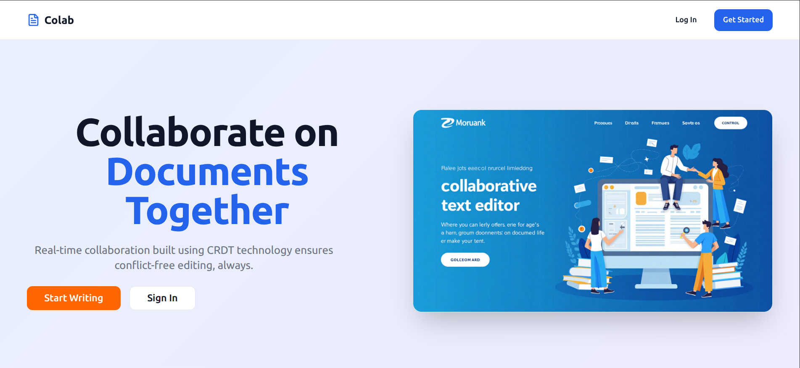

# Colab - Real-Time Collaborative Text Editor

A real-time collaborative text editor built with React, Django, and CodeMirror, featuring shared editing, rich text formatting, live cursors, comments, version control, and access management. The project uses a custom 2D array based CRDT (Conflict-Free Replicated Data Type).

This readme will be updated with more details soon!

## Features

### Implemented

- **Real-Time Collaboration** - Multiple users can edit documents simultaneously with instant synchronization
- **Access Management** - Granular permissions with role-based access control
- **Auto-Save** - Automatic document saving to prevent data loss
- **Active Users** - Showcasing number of active users on a given document

### ToDo
- **Live Cursors** - See collaborator positions in real-time with color-coded cursors
- **Rich Text Formatting** - Full support for text styling and formatting
- **Inline Comments** - Add contextual comments and discussions within documents
- **Version Control** - Track changes with comprehensive version history and rollback

## Screenshots

### LandingPage


### Login


### Dashboard


### Editor View


## Tech Stack

### Frontend
- React 18.x
- CodeMirror 6
- WebSocket
- Axios
- Tailwind CSS
- Radix-UI
- React-Hook-Form
- Tanstack Query

### Backend
- Django 4.x
- Django Channels
- Django REST Framework
- Redis

## Installation

### Prerequisites
- Node.js 16+
- Python 3.9+
- PostgreSQL 13+
- Redis 6+
- Docker

### Backend Setup

```bash
cd backend
python -m venv venv
source venv/bin/activate  # Windows: venv\Scripts\activate
pip install -r requirements.txt
python manage.py migrate
python manage.py createsuperuser
python manage.py runserver
```

### Redis Setup

```bash
docker run --rm -p 6379:6379 redis 
```

### Frontend Setup

```bash
cd frontend/frontend
npm install
# Create a dotenv file containing VITE_API_URL=http://localhost:8000
npm run dev
```

Access the application at:
- Frontend: `http://localhost:5173`
- Backend API: `http://localhost:8000`


## Component Overview

**Frontend Layer**
- CodeMirror handles local text editing and cursor positions
- Custom CRDT handles unified state for collaboration (local/remote operations)
- WebSocket client manages real-time communication
- AuthProvider handles authentication context 
- Axios interceptor handles automatic refreshing of tokens


**Backend Layer**
- Django REST Framework provides HTTP API endpoints protected using JWT 
- Django Channels handles WebSocket connections and groups for each document
- SQLite stores documents and user data
- Redis manages backend document state for autosaving

**Data Flow**
1. User edits trigger operations sent via WebSocket (connections or document operations)
2. Backend broadcasts changes to all connected clients
3. Clients apply operations to their local document state
4. Backend applies operations to backend document state
5. When last user leaves, backend document state is flushed to DB


## CRDT 

The CRDT was inspired by [Conclave](https://conclave-team.github.io/conclave-site/).


## To Do
- Implement remaining features (text styling, version history, etc)
- Finish writing tests
- Switch to PostgreSQL for the database and integrate
- Containerize the application using Docker
- Write a CI/CD pipeline for hosting
- Update Readme with all the above details

## Contact

**Jyotirmay Zamre**
- GitHub: [@jyotirmayzamre](https://github.com/jyotirmayzamre)
- Project: [https://github.com/jyotirmayzamre/Colab](https://github.com/jyotirmayzamre/Colab)