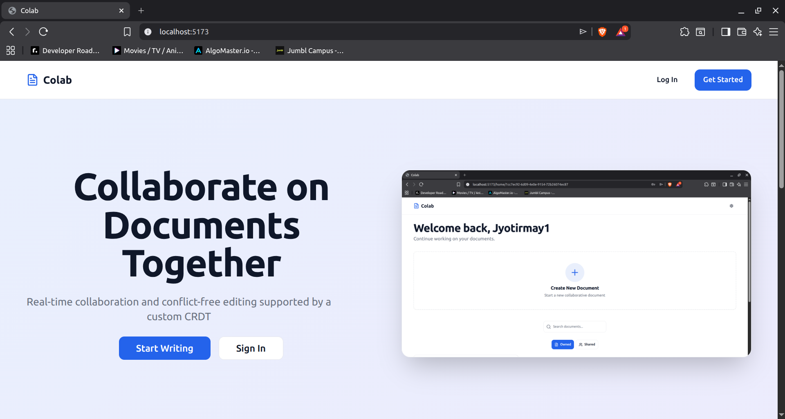
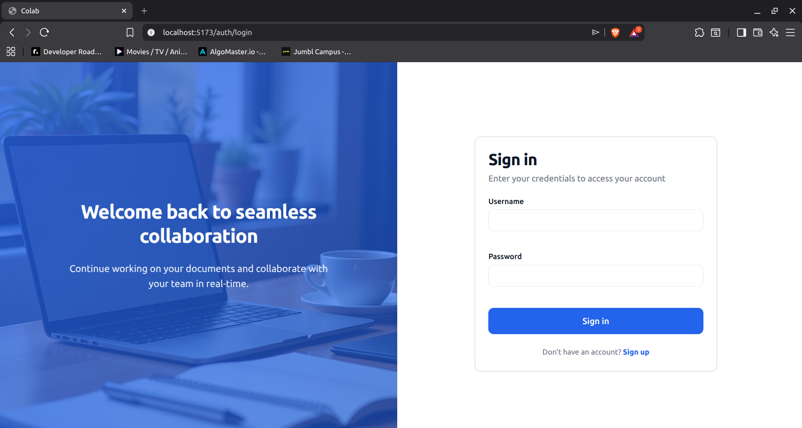
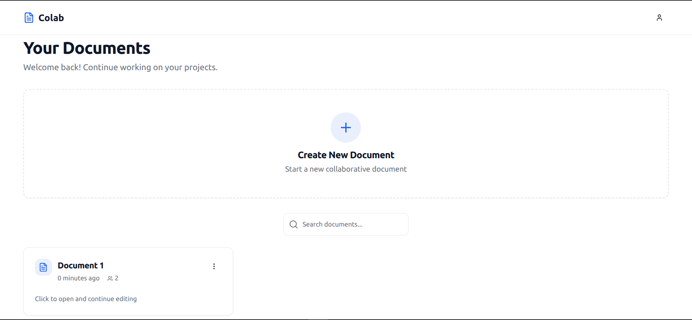
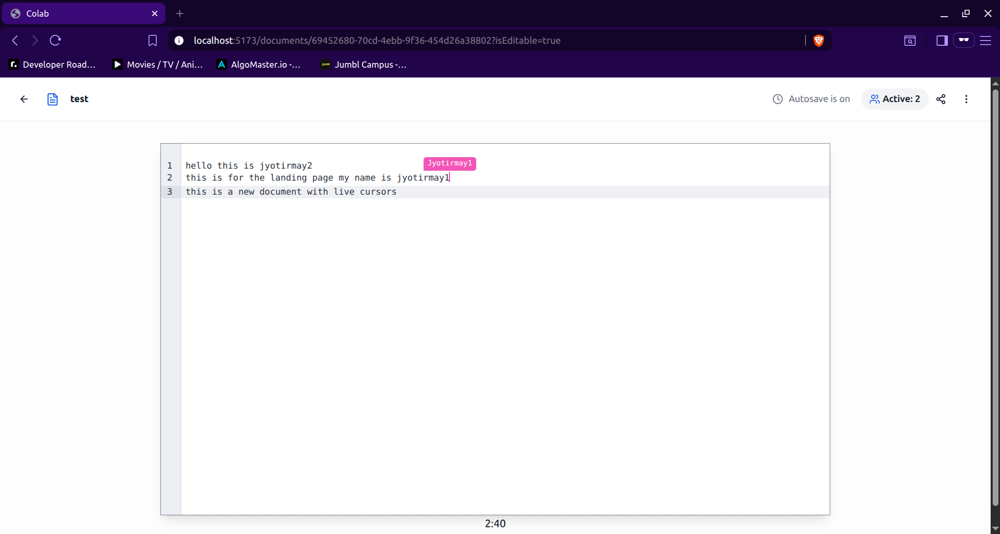

# Colab - Real-Time Collaborative Text Editor

A real-time collaborative text editor built with React, Django, and CodeMirror, featuring shared editing, live cursors, comments, version control, and access management. The project uses a custom 2D array based CRDT (Conflict-Free Replicated Data Type).

This project was initially built as a course project for CS-3810 (Design Practices in CS). However, I definitely did not do justice to the project at that time. This is my attempt in making a more complete, technically sound, and bug-free version of the project from scratch. Learnt a ton - WebSockets, caching, state sync techniques, good React design, abstraction complexity in DRF (did not enjoy the confusion this caused), comprehensive testing, pagination + virtualization, etc. Obviously this project is not perfect and I will try to improve it incrementally as my engineering and coding skills improve.

## Features

### Implemented

- **Real-Time Collaboration** - Multiple users can edit documents simultaneously with instant synchronization
- **Access Management** - Granular permissions with role-based access control
- **Auto-Save** - Automatic document saving to prevent data loss
- **Active Users** - Showcasing number of active users on a given document
- **Version Control** - Track changes with comprehensive version history and rollback
- **Live Cursors** - See collaborator positions in real-time with color-coded cursors

### ToDo
- **Notifications** - Email links to document upon sharing


## Screenshots

### LandingPage


### Login



### Dashboard



### Editor View



## Tech Stack

### Frontend
- React 18.x
- CodeMirror 6
- WebSocket
- Axios
- Tailwind CSS
- Radix-UI
- React-Hook-Form
- Tanstack Query

### Backend
- Django 4.x
- Django Channels
- Django REST Framework
- Redis

## Installation

### Prerequisites
- Node.js 16+
- Python 3.9+
- PostgreSQL 13+
- Redis 6+
- Docker
- Docker Compose

### How to build and run

```bash
docker compose up -d --build
```

Access the application at:
- Frontend: `http://localhost:5173`


## Component Overview

**Frontend Layer**
- CodeMirror handles local text editing and cursor positions
- Custom CRDT handles unified state for collaboration (local/remote operations)
- WebSocket client manages real-time communication
- AuthProvider handles authentication context 
- Axios interceptor handles automatic refreshing of tokens


**Backend Layer**
- Django REST Framework provides HTTP API endpoints protected using JWT 
- Django Channels handles WebSocket connections and groups for each document
- PostgreSQL stores documents and user data
- Redis manages backend document state for autosaving

**Data Flow**
1. User edits trigger operations sent via WebSocket (connections or document operations)
2. Backend broadcasts changes to all connected clients
3. Clients apply operations to their local document state
4. Backend applies operations to backend document state
5. When last user leaves, backend document state is flushed to DB


## CRDT 

The CRDT was inspired by [Conclave](https://conclave-team.github.io/conclave-site/).


## To Do
- Fix bugs
- Revamp landing page + some UI colours
- Finish writing tests
- Write a CI/CD pipeline for hosting
- Update Readme 

## Contact

**Jyotirmay Zamre**
- GitHub: [@jyotirmayzamre](https://github.com/jyotirmayzamre)
- Project: [https://github.com/jyotirmayzamre/Colab](https://github.com/jyotirmayzamre/Colab)
